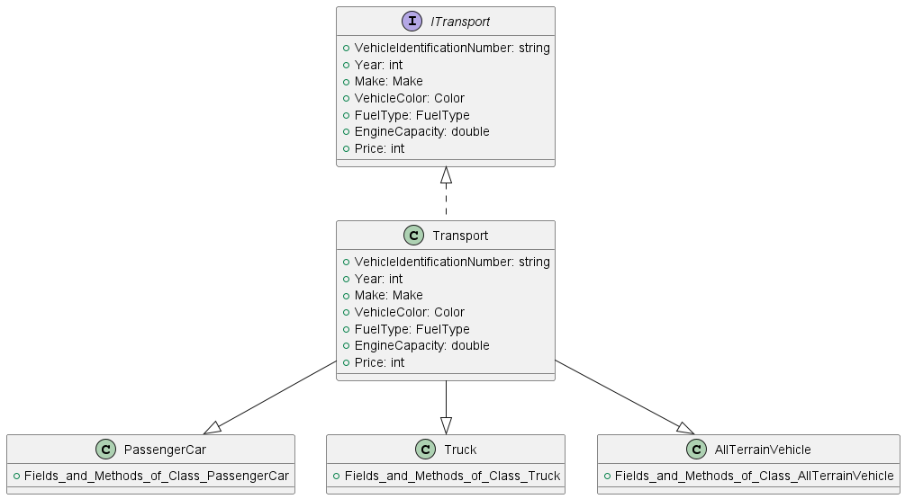

# Варіант 10

## Опис завдання
Створити програму для св'язування об'єктів різних класів у загальний масив на основі базового класу "Транспорт". 
Потім вивести вміст масиву на екран. Ваша програма має включати наступні класи: "Транспорт", "Легковий автомобіль", 
"Грузовий автомобіль" і "Всюдихід". Для кожного класу створити окремий файл з іменем відповідного класу.

## Вимоги до завдання
- Кожен клас має бути розміщений у відповідному файлі з іменем класу.
- Базовий клас "Транспорт" повинен мати не менше п'яти властивостей, які містять загальну інформацію про транспорт.
- Базовий клас "Транспорт" має містити об'єкт класу "ITransport" як агрегацію.
- Усі підкласи, які успадковують від базового класу, повинні мати не менше трьох додаткових властивостей, які описують 
об'єкт підкласу.
- Масив повинен формуватися з об'єктів принаймні трьох класів згідно з індивідуальним завданням.

**Зауваження**: Метод `toString()` повинен бути перевизначений у всіх класах.

## Діаграма класів
Діаграма класів, які об'єднуються класом, який описує предметну область, буде мати наступний вигляд, зображений на 
малюнку:

Оскільки восходячі перетворення виконуватимуться автоматично, створивши об'єкти різних класів "Легковий автомобіль", 
"Грузовий автомобіль" і "Всюдихід", які успадковують клас "Транспорт", ці об'єкти можна буде розмістити як елементи 
масиву.

## Функціональність
Реалізувати можливість додавання/видалення/редагування елементів масиву.

**Завдання створено на основі базового класу "Транспорт" та похідних класів "Легковий автомобіль", 
"Грузовий автомобіль", "Всюдихід".**
